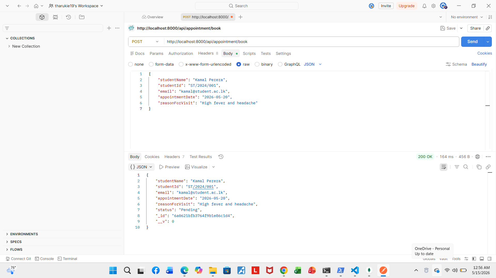
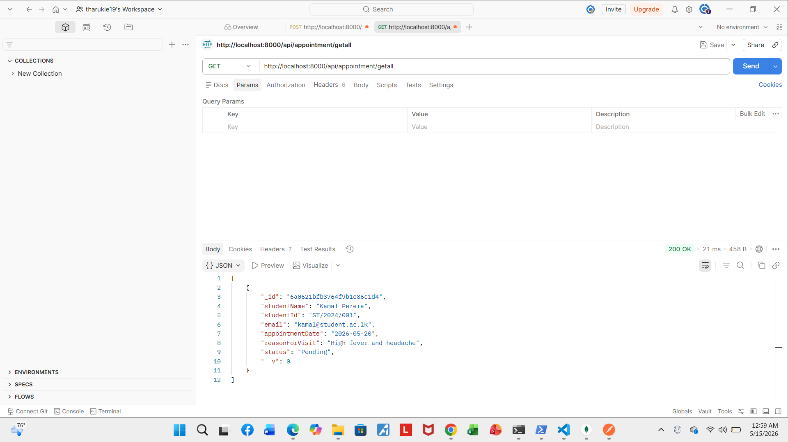
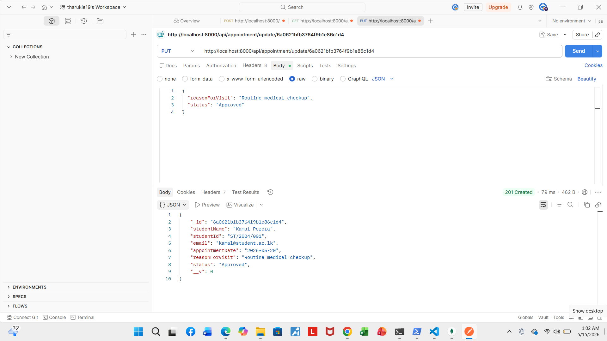
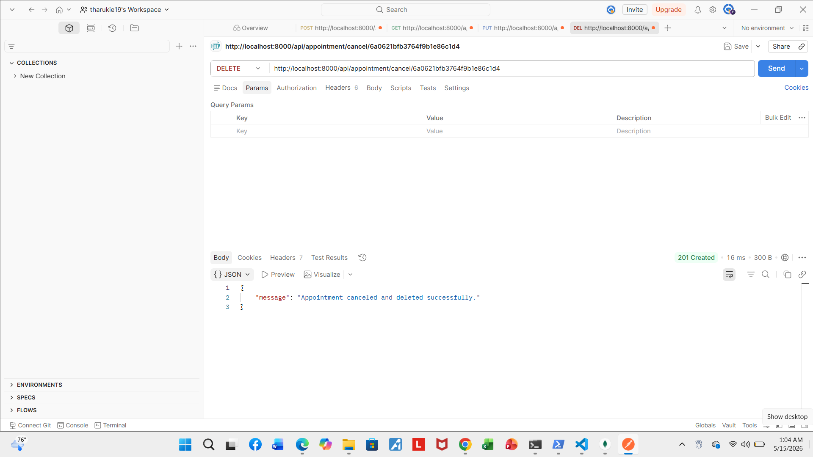
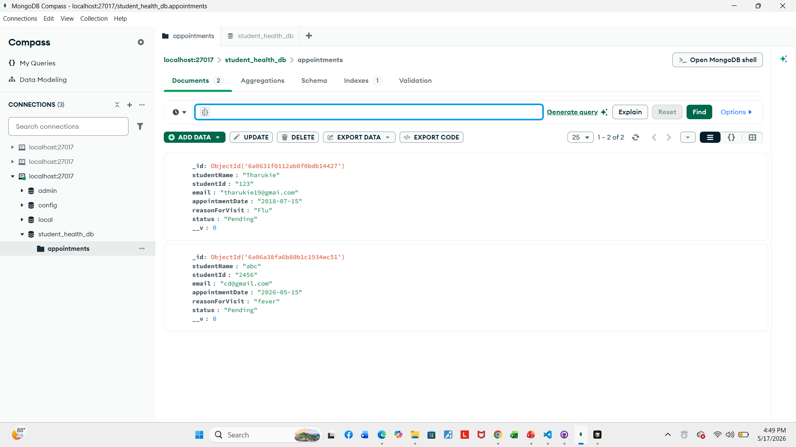
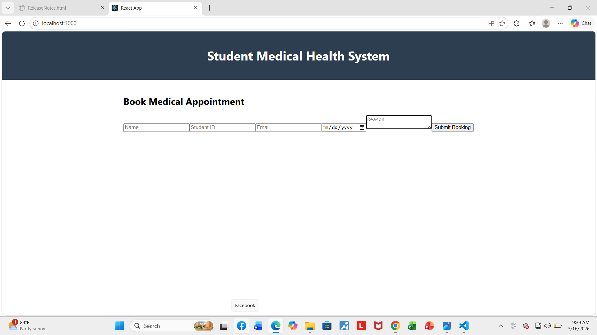
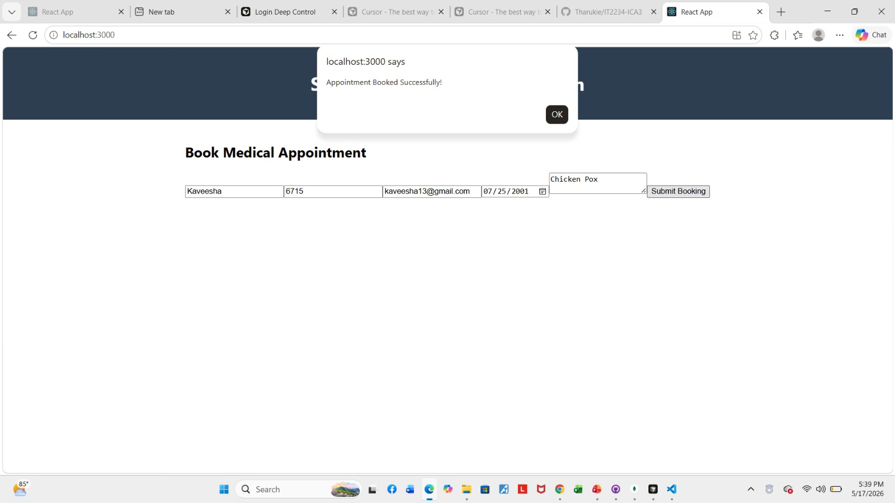
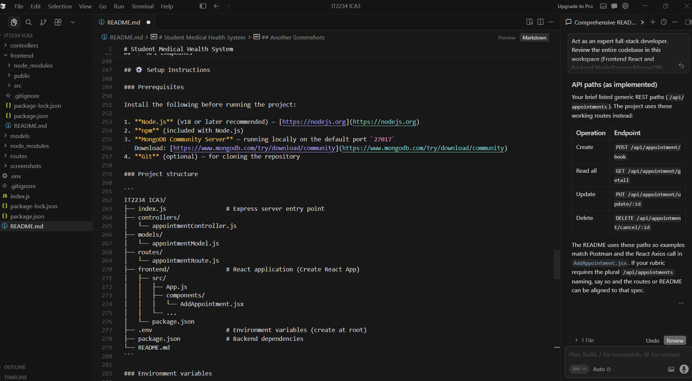

# Student Medical Health System

A full-stack **MERN** (MongoDB, Express.js, React, Node.js) web application designed for university campus clinics. The system digitises student medical appointment booking, centralises health-service records, and provides a RESTful API for administrative triage workflows—replacing paper forms and fragmented spreadsheets with a single, persistent data layer.

---

## 📋 Problem Description

University health centres routinely manage hundreds of student consultations each semester. In many institutions, this work still relies on **manual, paper-based processes** that introduce serious operational friction:

| Challenge | Impact |
|-----------|--------|
| **Paper registration forms** | Students queue at reception; staff re-type identical details (name, ID, email) into ledgers or spreadsheets. |
| **Duplicate and conflicting bookings** | Without a central system, the same student may book multiple slots on one day, or staff may double-book limited clinic capacity. |
| **Administrative overhead** | Nurses and administrators spend disproportionate time on data entry, filing, and phone follow-ups instead of patient care. |
| **Data fragility** | Physical records are easily lost, damaged, or misfiled; digital copies in ad-hoc Excel files lack schema validation, audit trails, and concurrent access controls. |
| **No real-time visibility** | Clinic managers cannot instantly see pending vs. approved appointments, triage priorities, or daily workload without manual collation. |

These bottlenecks slow healthcare delivery, increase human error, and weaken the integrity of student health data at a time when accurate, timely triage is essential.

---

## 💡 Proposed Solution

The **Student Medical Health System** addresses these gaps through a dedicated MERN application that automates the appointment lifecycle from booking to cancellation.

- **Structured digital intake:** Students submit appointments through a React web form; data is validated on the client and persisted in MongoDB via Express.
- **Automated healthcare triage support:** Each record carries a `status` field (defaulting to `Pending`) so clinic staff can approve, update, or cancel appointments through the API without manual ledger updates.
- **Streamlined data entry:** A single submission captures `studentName`, `studentId`, `email`, `appointmentDate`, and `reasonForVisit`—eliminating duplicate transcription.
- **Business-rule enforcement:** The backend rejects duplicate bookings for the same `studentId` on the same `appointmentDate`, reducing scheduling conflicts before they reach the clinic floor.
- **Modular backend architecture:** Routes, controllers, and Mongoose models are separated for maintainability, testability, and clear separation of concerns—supporting future extensions such as authentication, role-based dashboards, and reporting.

---

## 🚀 Features

### Three-column booking interface
The primary React view (`AddAppointment`) presents a **horizontal, multi-field layout** aligned in a single row: student name, student ID, email, appointment date, reason for visit, and submit action. This design mirrors a three-zone clinical intake desk—**identity**, **scheduling**, and **clinical reason**—allowing rapid data capture without page navigation.

### State management
React **`useState`** hooks manage controlled form inputs. The `handleChange` handler performs immutable state updates (`{ ...appointment, [name]: value }`), ensuring predictable re-renders and a single source of truth for submission payloads sent to the API via Axios.

### Security and data integrity enforcements
- **Mongoose schema validation:** All core fields (`studentName`, `studentId`, `email`, `appointmentDate`, `reasonForVisit`) are marked `required` at the database layer.
- **Duplicate-booking prevention:** `createAppointment` queries existing records before insert and returns `400` if the same student already has an appointment on the requested date.
- **Existence checks on update/delete:** `PUT` and `DELETE` handlers verify the MongoDB `_id` exists before mutating data, returning `404` when appropriate.
- **CORS middleware:** Enables secure cross-origin communication between the React dev server (`localhost:3000`) and the Express API (`localhost:8000`).
- **HTML5 client validation:** `required` attributes and `type="email"` / `type="date"` inputs provide first-line input sanitisation in the browser.

### Responsive design
- Centred main content with flexbox layout in `App.js`.
- Branded header bar with high-contrast typography for accessibility.
- `App.css` includes media-query support for adaptive rendering across viewport sizes.
- System font stack in `index.css` for consistent cross-platform appearance.

### RESTful API (full CRUD)
Complete Create, Read, Update, and Delete operations for appointment documents, verified via Postman and integrated with the React booking form.

---

## 🛠️ Technologies Used

| Layer | Technology | Role |
|-------|------------|------|
| **Frontend** | React 19 | Component-based UI |
| | React DOM | Rendering |
| | Axios | HTTP client for API communication |
| | Create React App (`react-scripts`) | Build tooling and dev server |
| | Inline styles & CSS (`App.css`, `index.css`) | Layout, typography, responsiveness |
| **Backend** | Node.js | JavaScript runtime |
| | Express 5 | HTTP server and routing |
| | Mongoose 9 | MongoDB ODM and schema enforcement |
| | body-parser | JSON request-body parsing |
| | cors | Cross-Origin Resource Sharing |
| | dotenv | Environment variable management |
| | nodemon | Auto-restart during development |
| **Database** | MongoDB | Document store for appointment records |
| **Architecture** | MVC pattern | `models/`, `controllers/`, `routes/` separation |

---

## 🔌 API Endpoints

**Base URL:** `http://localhost:8000`  
**Collection mount:** `/api/appointment`

All endpoints accept and return `application/json`.

---

### POST `/api/appointment/book`


Creates a new student medical appointment. Returns `400` if the student already has a booking on the same date.

**Request body:**

```json
{
  "studentName": "Kamal Perera",
  "studentId": "ST/2024/001",
  "email": "kamal@student.ac.lk",
  "appointmentDate": "2026-05-20",
  "reasonForVisit": "High fever and headache"
}
```

**Success response (`200 OK`):**

```json
{
  "studentName": "Kamal Perera",
  "studentId": "ST/2024/001",
  "email": "kamal@student.ac.lk",
  "appointmentDate": "2026-05-20",
  "reasonForVisit": "High fever and headache",
  "status": "Pending",
  "_id": "6a0621bfb3764f9b1e86c1d4",
  "__v": 0
}
```

**Duplicate booking error (`400 Bad Request`):**

```json
{
  "message": "You already have an appointment booked for this date."
}
```

---

### GET `/api/appointment/getall`



Retrieves all appointment records from the database.

**Success response (`200 OK`):**

```json
[
  {
    "_id": "6a0621bfb3764f9b1e86c1d4",
    "studentName": "Kamal Perera",
    "studentId": "ST/2024/001",
    "email": "kamal@student.ac.lk",
    "appointmentDate": "2026-05-20",
    "reasonForVisit": "High fever and headache",
    "status": "Pending",
    "__v": 0
  }
]
```

**Empty collection (`404 Not Found`):**

```json
{
  "message": "No medical appointments found."
}
```

---

### PUT `/api/appointment/update/:id`



Updates an existing appointment by MongoDB `_id`. Replace `:id` with the document identifier.

**Example URL:** `http://localhost:8000/api/appointment/update/6a0621bfb3764f9b1e86c1d4`

**Request body (partial update supported):**

```json
{
  "reasonForVisit": "Routine medical checkup",
  "status": "Approved"
}
```

**Success response (`201 Created`):**

```json
{
  "_id": "6a0621bfb3764f9b1e86c1d4",
  "studentName": "Kamal Perera",
  "studentId": "ST/2024/001",
  "email": "kamal@student.ac.lk",
  "appointmentDate": "2026-05-20",
  "reasonForVisit": "Routine medical checkup",
  "status": "Approved",
  "__v": 0
}
```

**Not found (`404 Not Found`):**

```json
{
  "message": "Appointment record not found."
}
```

---

### DELETE `/api/appointment/cancel/:id`



Cancels and permanently removes an appointment by MongoDB `_id`.

**Example URL:** `http://localhost:8000/api/appointment/cancel/6a0621bfb3764f9b1e86c1d4`

**Success response (`201 Created`):**

```json
{
  "message": "Appointment canceled and deleted successfully."
}
```

**Not found (`404 Not Found`):**

```json
{
  "message": "Appointment record not found."
}
```

---

### Appointment schema reference

| Field | Type | Required | Description |
|-------|------|----------|-------------|
| `studentName` | String | Yes | Full name of the student |
| `studentId` | String | Yes | University student identifier |
| `email` | String | Yes | Contact email address |
| `appointmentDate` | String | Yes | Date of visit (ISO date string) |
| `reasonForVisit` | String | Yes | Symptoms or purpose of visit |
| `status` | String | No | Triage status; defaults to `Pending` |

---

## ⚙️ Setup Instructions

### Prerequisites

Install the following before running the project:

1. **Node.js** (v18 or later recommended) — [https://nodejs.org](https://nodejs.org)
2. **npm** (included with Node.js)
3. **MongoDB Community Server** — running locally on the default port `27017`  
   Download: [https://www.mongodb.com/try/download/community](https://www.mongodb.com/try/download/community)
4. **Git** (optional) — for cloning the repository

### Project structure

```
IT2234 ICA3/
├── index.js                 # Express server entry point
├── controllers/
│   └── appointmentController.js
├── models/
│   └── appointmentModel.js
├── routes/
│   └── appointmentRoute.js
├── frontend/                # React application (Create React App)
│   ├── src/
│   │   ├── App.js
│   │   ├── components/
│   │   │   └── AddAppointment.jsx
│   │   └── ...
│   └── package.json
├── .env                     # Environment variables (create at root)
├── package.json             # Backend dependencies
└── README.md
```

### Environment variables

Create a `.env` file in the **project root** (same directory as `index.js`) with the following variables:

```env
PORT=8000
MONGO_URL="mongodb://localhost:27017/student_health_db"
```

| Variable | Description |
|----------|-------------|
| `PORT` | Port on which the Express server listens (default fallback: `5000` if unset) |
| `MONGO_URL` | MongoDB connection string; database name `student_health_db` stores the `appointments` collection |

> **Note:** Ensure MongoDB is running before starting the backend. The server logs `Database connected successfully.` on a successful connection.

### Install dependencies

Open a terminal in the project root and run:

```bash
# Install backend dependencies
npm install
```

Open a second terminal (or run sequentially) for the frontend:

```bash
# Navigate to the React app and install frontend dependencies
cd frontend
npm install
cd ..
```

---

## 💻 How to Run the Project

The application requires **two terminals**—one for the backend API and one for the React development server.

### Terminal 1 — Start the backend (Express + MongoDB)

From the **project root**:

```bash
npm start
```

Expected console output:

```
Database connected successfully.
Server is running on port: 8000
```

The API is now available at `http://localhost:8000`.

### Terminal 2 — Start the frontend (React)

From the **project root**, navigate into the frontend folder and start the dev server:

```bash
cd frontend
npm start
```

The React app automatically opens in your browser at `http://localhost:3000`.

### Verify the system

1. Open `http://localhost:3000` and complete the **Book Medical Appointment** form.
2. Click **Submit Booking** — a success alert confirms the Axios `POST` to `/api/appointment/book`.
3. Use Postman (or similar) to test `GET`, `PUT`, and `DELETE` endpoints against `http://localhost:8000`.
4. Confirm records in MongoDB Compass or the `mongosh` shell:

   ```bash
   mongosh
   use student_health_db
   db.appointments.find()
   ```

### Stopping the servers

Press `Ctrl + C` in each terminal to stop the backend and frontend processes.

## Another Screenshots





---

## Author

**IT2234 ICA3** — Individual Coursework Assignment  
Full-Stack Web Development (MERN Stack)
